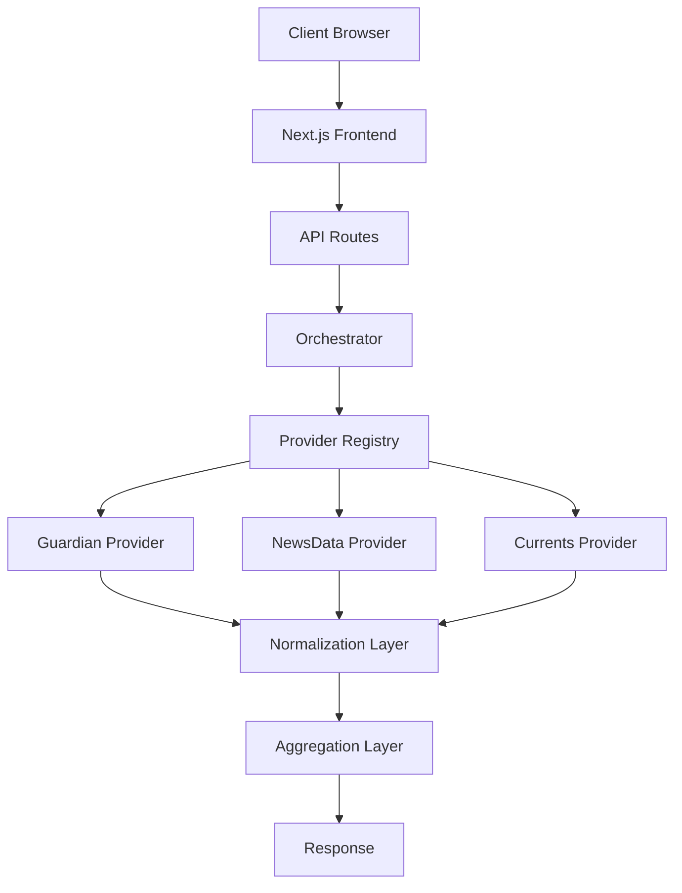
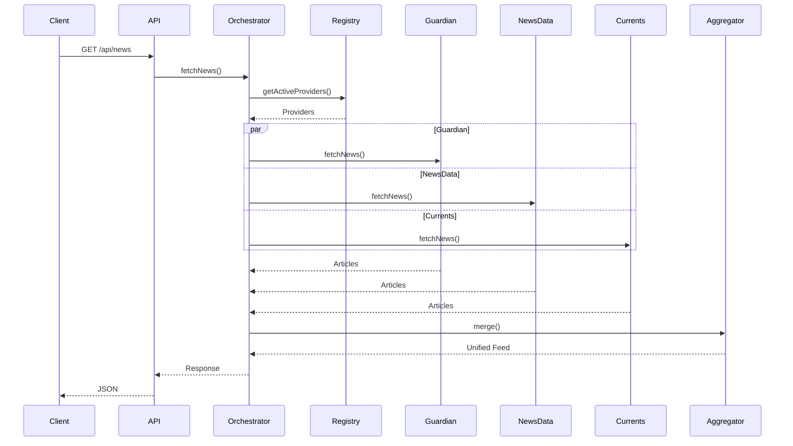

# DailyPlanet Technical Design Document

## 1. Executive Summary

DailyPlanet is a news aggregation platform built using Next.js 16, React 19, and TypeScript. The system aggregates articles from multiple news providers, including The Guardian, NewsData.io, and Currents API, and presents them through a unified interface for browsing and search.

The application is designed around a provider-based architecture. Each provider implements a common interface, allowing the system to normalize different API responses into a shared article schema. An orchestration layer coordinates requests across providers, aggregates results, removes duplicate articles, and returns a chronologically sorted feed to the client.

The platform supports category-based browsing, keyword search, country filtering, date-range filtering, and infinite scrolling. To provide a consistent user experience despite differing provider pagination mechanisms, the system employs a composite cursor pagination model that combines provider-specific pagination state into a single encoded token.

Performance and reliability are improved through parallel provider requests, server-side response caching, Redis-backed rate limiting, and fault-tolerant request handling. The architecture is designed to be extensible, allowing additional news providers to be integrated with minimal changes to the core system.

This document describes the architecture, component interactions, design decisions, data flow, and scalability considerations of the DailyPlanet platform.


## 2. High-Level Architecture

DailyPlanet uses a layered architecture to aggregate news from multiple external providers through a unified interface. User requests are handled by Next.js API routes, which delegate processing to an orchestration layer responsible for provider selection and request execution.

Provider responses are normalized into a common article schema before being aggregated, deduplicated, sorted, and returned to the client. This design isolates provider-specific logic while providing a consistent experience for search, filtering, and pagination.




## 3. System Components

This section describes the major software components that make up the DailyPlanet platform and their responsibilities.

### 3.1 Frontend Components

The frontend is implemented using Next.js and React and is responsible for presenting aggregated news content to users.

Key frontend components include:

#### NewsFeed

Responsible for:

* Displaying article collections
* Managing infinite scrolling
* Requesting additional pages of data

#### NewsCard

Responsible for:

* Rendering individual article information
* Displaying article metadata
* Providing links to original sources

#### GlobalSearchBar

Responsible for:

* Accepting search queries
* Triggering search requests
* Updating application state

#### CountryFilter

Responsible for:

* Allowing users to filter news by country
* Updating active search parameters

#### CatTabs

Responsible for:

* Category selection
* Navigation between article categories

---

### 3.2 API Layer

The API layer exposes server-side endpoints used by the frontend.

#### `/api/news`

Responsible for:

* Retrieving aggregated headlines
* Applying filters
* Managing pagination
* Enforcing rate limits

#### `/api/search`

Responsible for:

* Executing cross-provider searches
* Returning normalized search results
* Managing pagination

---

### 3.3 Orchestration Layer

The orchestration layer acts as the central coordinator of the system.

Implemented in:

```text
src/lib/news/orchestrator.ts
```

Responsibilities include:

* Selecting active providers
* Coordinating search operations
* Coordinating headline retrieval
* Executing provider requests in parallel
* Collecting provider responses
* Managing pagination state

The orchestration layer provides a unified execution pipeline for both search and headline retrieval operations.

---

### 3.4 Provider Registry

The provider registry maintains information about all available providers.

Implemented in:

```text
src/lib/news/registry.ts
```

Responsibilities include:

* Provider registration
* Environment validation
* Capability-based provider selection

The registry dynamically selects providers based on requested filters.

Examples of provider capabilities:

* Country filtering
* Date-range filtering

Providers that cannot satisfy requested filters are automatically excluded.

---

### 3.5 Provider Implementations

Provider implementations are responsible for communicating with external news APIs.

Current providers include:

#### Guardian Provider

Responsibilities:

* Fetching articles from The Guardian API
* Category mapping
* Date-range filtering support

#### NewsData Provider

Responsibilities:

* Fetching articles from NewsData.io
* Category mapping
* Country filtering support

#### Currents Provider

Responsibilities:

* Fetching articles from Currents API
* Country filtering support
* Date-range filtering support

All providers implement a common provider interface to ensure consistent behavior across the system.

---

### 3.6 Normalization Layer

Implemented in:

```text
src/lib/normalize.ts
```

Responsibilities include:

* Converting provider-specific responses into a unified article schema
* Standardizing article metadata
* Ensuring consistent response structures

This abstraction isolates provider-specific response formats from the rest of the application.

---

### 3.7 Aggregation Layer

Implemented in:

```text
src/lib/aggregate.ts
```

Responsibilities include:

* Combining provider responses
* Removing duplicate articles
* Sorting articles chronologically

The aggregation layer produces the final article collection returned to clients.

---

### 3.8 Pagination Layer

Implemented in:

```text
src/lib/cursorEncoder.ts
src/lib/news/pagination.ts
```

Responsibilities include:

* Managing provider-specific pagination state
* Encoding pagination information
* Generating unified pagination cursors

This layer abstracts differences between provider pagination mechanisms and presents a single pagination interface to clients.

---

### 3.9 Rate Limiting Layer

Implemented in:

```text
src/lib/rateLimit.ts
```

Responsibilities include:

* Tracking request volumes
* Enforcing request limits
* Protecting external API quotas
* Preventing abuse

Rate limiting is backed by Upstash Redis and applied at the API layer.


## 4. Request Flow



### 4.1 News Feed Flow

The news feed workflow is initiated when a user requests articles through the `/api/news` endpoint.

1. The client sends a request containing optional category, country, date-range, and pagination parameters.
2. The API layer validates the request and applies rate limiting.
3. The orchestration layer requests a list of compatible providers from the provider registry.
4. The registry excludes providers that do not support the requested filters.
5. Active providers are queried concurrently.
6. Provider responses are normalized into a common article schema.
7. The aggregation layer combines results, removes duplicate articles, and sorts articles by publication date.
8. A composite pagination cursor is generated for subsequent requests.
9. The aggregated response is returned to the client.


### 4.2 Search Flow

The search workflow follows the same processing pipeline as the news feed workflow but includes a user-provided search query.

1. The client sends a request to the `/api/search` endpoint with a search term and optional filters.
2. The API layer validates the request and applies rate limiting.
3. The orchestration layer selects compatible providers through the provider registry.
4. Search requests are executed concurrently across all active providers.
5. Provider-specific responses are normalized into the unified article schema.
6. Results are aggregated, deduplicated, and sorted.
7. Pagination metadata is generated and returned with the response.
8. The client displays the resulting article collection.


## 5. Provider Architecture

DailyPlanet uses a provider-based architecture to abstract interactions with external news services. Each news source is implemented as a provider that conforms to a common interface, allowing the rest of the system to interact with all providers in a consistent manner regardless of their underlying API implementations.

This approach isolates provider-specific logic from the orchestration and aggregation layers, simplifying maintenance and enabling new providers to be integrated with minimal changes to the core system.

### 5.1 Provider Interface

All providers implement a shared interface that defines the operations required by the orchestration layer.

The interface standardizes:

* News retrieval
* Search operations
* Pagination handling
* Provider capability metadata
* Response normalization

By enforcing a common contract, the orchestration layer can interact with all providers without requiring provider-specific logic.

### 5.2 Provider Registry

The provider registry maintains a list of all available providers and is responsible for provider selection.

Before a request is executed, the registry evaluates provider capabilities and excludes providers that cannot satisfy the requested filters.

Current provider capabilities include:

* Country filtering support
* Date-range filtering support

This ensures that only compatible providers participate in request execution.

### 5.3 Provider Implementations

The system currently supports three providers:

1. Guardian
2. NewsData.io
3. Currents

Each provider is responsible for:

* Constructing provider-specific API requests
* Mapping categories to provider-specific values
* Handling pagination
* Normalizing responses into the common article schema

### 5.4 Provider Execution

Once active providers have been selected, the orchestration layer executes requests concurrently across all providers.

Parallel execution reduces overall response latency and allows the system to aggregate results from multiple sources efficiently.

Provider responses are returned independently and processed by the normalization and aggregation layers before being sent to the client.

### 5.5 Extensibility

The provider architecture was designed to support future expansion.

To integrate a new news source, a developer must:

1. Implement the provider interface.
2. Register the provider in the provider registry.
3. Configure category mappings and provider capabilities.

No modifications to the orchestration or aggregation layers are required, allowing the platform to scale horizontally as additional providers are introduced.


## 6. Filtering System

DailyPlanet supports category, country, and date-range filtering across multiple news providers. Since providers expose different filtering capabilities, the system uses capability-based provider selection to ensure only compatible providers participate in request execution.

Before a request is processed, the provider registry evaluates the requested filters and excludes providers that cannot satisfy them. This prevents unsupported filters from producing inconsistent or inaccurate results.

### 6.1 Category Filtering

Category filtering is supported by all providers.

User-facing categories are mapped to provider-specific category values through a centralized category mapping layer. This abstraction allows a single category selection to be translated into the appropriate format required by each external API.

### 6.2 Country Filtering

Country filtering is supported by NewsData and Currents providers.

When a country filter is specified, providers that do not support country-based filtering are automatically excluded from execution.

This ensures that all returned articles satisfy the requested geographic constraints.

### 6.3 Date Filtering

Date-range filtering is supported by Guardian and Currents providers.

When a date range is supplied, the provider registry excludes providers that cannot perform date-based filtering.

This allows the system to return results that accurately reflect the requested time window without requiring additional client-side filtering.

### 6.4 Capability-Based Provider Selection

Provider selection is performed dynamically using capability metadata exposed by each provider.

```ts
if (opts.country && !provider.supportsCountryFilter)
  return false

if (opts.startDate && opts.endDate && !provider.supportsDateFilter)
  return false
```

The registry evaluates provider capabilities before request execution and automatically excludes providers that cannot satisfy the requested filters.

| Provider | Category Filter | Country Filter | Date Filter |
| -------- | --------------- | -------------- | ----------- |
| Guardian | ✓               | ✗              | ✓           |
| NewsData | ✓               | ✓              | ✗           |
| Currents | ✓               | ✓              | ✓           |

This approach allows filtering behavior to remain consistent while supporting providers with different feature sets.


## 7. Pagination Design

DailyPlanet aggregates content from multiple news providers, each of which exposes a different pagination mechanism. While Guardian and Currents use page-based pagination, NewsData uses cursor-based pagination.

This creates a challenge when presenting a single unified feed to the client, as the application must maintain pagination state for multiple providers simultaneously.

### 7.1 Problem Statement

A traditional pagination model assumes that all data originates from a single source with a single pagination strategy.

In DailyPlanet, each provider maintains its own pagination state:

* Guardian uses page numbers
* Currents uses page numbers
* NewsData uses cursor tokens

As a result, the client cannot directly interact with provider-specific pagination mechanisms.

### 7.2 Composite Cursor Model

To provide a consistent pagination experience, DailyPlanet uses a composite cursor model.

The pagination state of all active providers is combined into a single object:

```json
{
  "guardianPage": 2,
  "newsDataCursor": "abc123",
  "currentsPage": 3
}
```

This object represents the complete pagination state required to retrieve the next batch of results.

### 7.3 Cursor Encoding

The composite pagination state is encoded and returned to the client as a single pagination token.

The client treats this token as an opaque value and includes it in subsequent requests when requesting additional results.

This approach hides provider-specific implementation details from the client while maintaining support for heterogeneous pagination strategies.

### 7.4 Pagination Workflow

1. Providers return articles and updated pagination state.
2. The orchestration layer combines provider pagination information.
3. The pagination layer generates a composite cursor.
4. The cursor is encoded and returned as the `nextPage` value.
5. The client supplies the cursor in subsequent requests.
6. The pagination layer decodes the cursor and restores provider-specific state.

### 7.5 Benefits

The composite cursor model provides several advantages:

* Unified pagination across multiple providers
* Provider-specific pagination complexity remains hidden from clients
* Support for heterogeneous pagination mechanisms
* Simplified frontend implementation
* Extensibility for future providers

## 8. Error Handling & Fault Tolerance

DailyPlanet incorporates multiple error handling mechanisms to ensure reliability when interacting with external services and processing client requests.

### 8.1 Request Validation

Incoming requests are validated before processing begins.

Validation includes:

* Required parameter checks
* Date range validation
* Category validation
* Pagination cursor validation

Invalid requests are rejected with an appropriate error response before any provider requests are executed.

### 8.2 Provider Failures

The platform depends on multiple third-party news providers, each of which may experience downtime, rate limits, or unexpected API changes.

Provider requests are isolated from one another, allowing the system to continue operating even if an individual provider fails.

If a provider encounters an error, the failure is logged and remaining providers continue processing the request.

This approach prevents a single provider outage from making the entire service unavailable.

### 8.3 Environment Validation

During application startup, the provider registry validates that all required API credentials are present.

```ts
const missingKeys: string[] = []

if (!process.env.GUARDIANAPI_KEY)
  missingKeys.push("GUARDIANAPI_KEY")

if (!process.env.NEWSDATA_API_KEY)
  missingKeys.push("NEWSDATA_API_KEY")

if (!process.env.CURRENTNEWS_API_KEY)
  missingKeys.push("CURRENTNEWS_API_KEY")
```

If required configuration values are missing, the application fails fast and reports the missing environment variables.

### 8.4 Rate Limiting

To prevent abuse and protect external API quotas, server-side rate limits are enforced using Upstash Redis.

Requests exceeding configured limits receive an error response and are prevented from executing provider requests.

This protects both infrastructure resources and third-party API quotas.

### 8.5 Fault Tolerance Strategy

The system is designed to degrade gracefully when failures occur.

Key fault-tolerance measures include:

* Provider isolation
* Independent provider execution
* Partial result delivery
* Configuration validation
* Rate limiting

These mechanisms ensure that the platform remains operational even when external dependencies become unavailable.

## 9. Performance Optimizations

DailyPlanet incorporates several optimizations to reduce response times, minimize external API usage, and improve scalability.

### 9.1 Parallel Provider Execution

News providers are queried concurrently rather than sequentially.

By executing provider requests in parallel, the total response time is determined by the slowest provider rather than the combined latency of all providers.

This significantly reduces the time required to aggregate content from multiple sources.

### 9.2 Server-Side Caching

External API requests are cached using Next.js fetch revalidation.

Cached responses can be served without contacting the underlying provider, reducing latency and decreasing the number of external API requests.

Caching also helps preserve limited API quotas provided by third-party services.

### 9.3 Infinite Scrolling

The frontend implements infinite scrolling to load articles incrementally.

Instead of retrieving a large number of articles during the initial request, content is loaded in smaller batches as the user navigates through the feed.

This reduces initial page load times and improves perceived responsiveness.

### 9.4 Aggregation and Deduplication

Provider responses are normalized and aggregated on the server before being returned to the client.

Duplicate articles are removed during aggregation, reducing unnecessary data transfer and preventing repeated content from appearing in the feed.

### 9.5 Rate Limiting

Server-side rate limiting is enforced using Upstash Redis.

Rate limiting protects external API quotas and prevents excessive request volumes from impacting application performance.

By controlling traffic at the API layer, the system can maintain predictable resource utilization under varying load conditions.

## 10. API Specification

DailyPlanet exposes two primary API endpoints that provide access to aggregated news content and search functionality.

### 10.1 News Endpoint

**Route**

```text
GET /api/news
```

**Purpose**

Returns aggregated news articles from all compatible providers.

**Supported Parameters**

| Parameter | Description                 |
| --------- | --------------------------- |
| category  | Filter articles by category |
| country   | Filter articles by country  |
| startDate | Start of date range         |
| endDate   | End of date range           |
| page      | Composite pagination cursor |

**Response Structure**

```json
{
  "success": true,
  "articles": [...],
  "nextPage": "encodedCursor"
}
```

---

### 10.2 Search Endpoint

**Route**

```text
GET /api/search
```

**Purpose**

Performs keyword-based searches across all compatible providers.

**Supported Parameters**

| Parameter | Description                 |
| --------- | --------------------------- |
| query     | Search term                 |
| category  | Filter results by category  |
| country   | Filter results by country   |
| startDate | Start of date range         |
| endDate   | End of date range           |
| page      | Composite pagination cursor |

**Response Structure**

```json
{
  "success": true,
  "articles": [...],
  "nextPage": "encodedCursor"
}
```

---

### 10.3 Unified Article Schema

All provider responses are normalized into a common schema before being returned to clients.

```ts
{
  title: string
  url: string
  category: string[]
  source: string
  publishedAt: string
  content: string
  byline?: string
  thumbnail?: string
}
```

This abstraction allows client applications to consume news content without requiring knowledge of provider-specific response formats.

---

### 10.4 Pagination

Both endpoints support cursor-based pagination through the `page` parameter.

The cursor contains encoded provider-specific pagination state and is generated by the pagination layer.

Clients should treat the cursor as an opaque value and pass it unchanged in subsequent requests.

---

### 10.5 Error Responses

Error responses follow a consistent structure:

```json
{
  "success": false,
  "error": "Error message"
}
```

Errors may be returned for:

* Invalid request parameters
* Missing search terms
* Rate limit violations
* Internal server errors


## 11. Testing Strategy

DailyPlanet is designed to support testing at multiple levels, including unit testing, integration testing, and end-to-end testing. This layered approach ensures that individual components, system interactions, and user workflows can be validated independently.

### 11.1 Unit Testing

Unit tests focus on validating isolated business logic without requiring external dependencies.

Key areas for unit testing include:

* Article normalization
* Category mapping
* Aggregation and deduplication
* Cursor encoding and decoding
* Provider selection logic

These tests ensure that core functionality behaves correctly under a variety of inputs and edge cases.

### 11.2 Integration Testing

Integration tests verify interactions between internal components and API routes.

Key integration test scenarios include:

* News retrieval through `/api/news`
* Search functionality through `/api/search`
* Pagination handling
* Filter application
* Rate limiting behavior

Integration testing ensures that requests are processed correctly throughout the application pipeline.

### 11.3 External API Mocking

Third-party news providers should be mocked during automated testing to avoid dependency on external services.

Mocking provides several benefits:

* Consistent test results
* Faster execution
* Reduced API quota consumption
* Isolation from provider downtime

Provider responses can be simulated using representative sample payloads obtained from Guardian, NewsData, and Currents APIs.

### 11.4 End-to-End Testing

End-to-end testing validates complete user workflows through the frontend interface.

Example scenarios include:

* Browsing news articles
* Performing searches
* Applying category filters
* Applying country filters
* Applying date-range filters
* Loading additional content through infinite scrolling

These tests verify that the application behaves correctly from a user's perspective.

### 11.5 Test Coverage Goals

The primary testing focus should be placed on the system's core business logic and integration points.

High-priority areas include:

* Provider orchestration
* Capability-based provider selection
* Pagination state management
* Aggregation and deduplication
* API endpoint behavior

Testing these components provides confidence in the correctness and reliability of the platform.


## 12. Scalability Considerations

DailyPlanet was designed with scalability and maintainability as primary architectural goals. The system's modular structure allows individual components to evolve independently as requirements grow.

### 12.1 Provider Scalability

The provider-based architecture allows additional news sources to be integrated without modifying the orchestration or aggregation layers.

To add a new provider, a developer must:

1. Implement the provider interface.
2. Register the provider in the provider registry.
3. Configure category mappings and capability metadata.

This approach enables the platform to scale horizontally as additional content sources are introduced.

### 12.2 Feature Scalability

The capability-based provider selection mechanism allows new filtering features to be introduced incrementally.

Providers can advertise support for new capabilities without requiring changes to existing provider implementations.

This reduces coupling between providers and core application logic.

### 12.3 Traffic Scalability

The application is built on Next.js server-side infrastructure and incorporates caching and rate limiting to reduce load on both internal services and external providers.

As traffic increases, additional caching strategies and distributed deployments can be introduced without significant architectural changes.

### 12.4 Data Source Scalability

Because all provider responses are normalized into a common article schema, the aggregation layer remains independent of provider-specific response formats.

This ensures that increasing the number of providers does not significantly increase system complexity.

### 12.5 Future Scaling Opportunities

Potential future improvements include:

* Additional news providers
* Distributed caching layers
* Search indexing for faster query performance
* Provider-specific health monitoring
* Analytics and recommendation systems

The current architecture provides a foundation for these enhancements while maintaining separation of concerns between system components.


## 13. Future Improvements# 